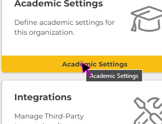

| How to Use GPA Calculations in Academic Settings ||
|-|-|
| #1 ||
|  Click on the 'Organization' Left-Nav Menu Icon. ||
| #2 ||
|  Click on the 'Academic Settings' Button. ||
| #3 ||
| Click on the 'GPA Calculations' Button. ||
| #4 ||
| In this view you can see any existing GPA Calculation Groups. ||
| #5 ||
| To add a new 'GPA Calculations' Group, click the blue '+ Add Group' Button. ||
| #6 ||
| Next, click on the 'GPA Calcuation Group' text field and enter the desired name. For example, 'Gradual School' or 'Dual Credit'  ||
| #7 ||
| Once you have selected and typed a Group Title, click on the '+ Add' Button to add the GPA Calculation Group to the list. ||
| Note: ||
|  Whatever Title you choose for your 'GPA Calculations' Group will ultimately be visible on the student's transcript. ||
| #8 ||
| Once the New Group has been added, click 'Add Stack' icon to add a GPA Subgroup. GPA Subgroups can be used in instances where an institution changes it’s grading scale , such that prior students transcripts and GPAs are not retroactively recalculated based on the new scale. ||
| #9 ||
| Next, click on the 'GPA Calcuation Group' text field and enter the desired name. If there is only one subgroup needed, it is recommended to name it the same as the parent group. If there is multiple subgroups needed, it's recommended to name them based on a time-frame; for example '2024-Current' or 'Before 2022' and so on. ||
| Note: ||
|  Unlike the parent GPA Calculations Group title, the child GPA Calculation subgroup will not be visible on the students' transcript. ||
| #10 ||
| Once you have selected a subgroup title, click the '+ Add' button to add it to the GPA Caclulation Group Parent. ||
| #11 ||
| Next click the down arrow next to the new Subgroup to expand the new GPA subcategory. ||
| #12 ||
| Next, click the 'Add Stack' button next to the new Subgroup to add a new Letter Grade Category. ||
| #13 ||
| Click on the 'Letter Grade' text box and enter the letter grade, for example, 'A' or 'B'. ||
| #14 ||
| Click on the 'Min Grade' text box and enter the minimum grade for the given Grade Letter, for example, '70' or '80'. ||
| #15 ||
| Click on the 'Max Grade' text box and enter the maximum grade for the given Letter Grade,  for example, '90' or '100'. ||
| #16 ||
| Click on the edit 'GPA Number' text field and enter the desired grade points, for example '3.0' or '4.0' ||
| #17 ||
| Once you are happy with all fields, click the '+ Add' button to add the current calculation to the subgroup. ||
| #18 ||
| After clicking '+ Add' another empty row of letter grade fields will be automatically added. Repeat steps 15-19 untill all releveant Letter Grade categories have been added. ||
| #19 ||
| Please take note of some of the additional icons, the Ssetting Gear' contains additional settings per GPA Calculation Group and the 'Trash Can' icon can be used to delete Groups or Subgroups. ||
| #20 ||
| Similarly, the Letter Grades rows have their own set of icons for editing, saving, and removing the letter grades. ||
| Finish: ||
|  This concludes the guide on 'How to Use GPA Calculations in Academic Settings' ||
