[Watch the Video](https://www.youtube.com/watch?v=eTUQvMMXua0)

  
Video Transcript

  This video, I would like to show you how to make a discussion module using the assignment module format and our forum.

~

So, let's come back here to the assignment module. We're back here, we've opened up the assignment module, and we're going to call this discussion post.

~

What would come up then for the student if you're going through the course is you can have these instructions: go to the forum and answer the week one discussion post, submit a document that you've completed the assignment.

~

So that's one thing that the student would know that it's time now to go to the discussion post. Then, as we've seen in the way the assignment module works, afterwards the student would get a short notification: "Thank you for your submission."

~

Now let's go to the forum and show how that works.

~

We're going to go over to the home area and we're going to go through this in a minute. We're going to go to discussion right here, and here's our forums.

~

I'll just open these up and let you see what these look like. So here would be like week one, and we've had some different questions that you can pre-program as to when you want that.

~

When anyone replies, you will see this. There will be application: how would you use the audio module? I'll just say for fun, and let's see what comes up.

~

Then you'll see right here that someone has put their answer in. This also can tell you the time and the date that this was submitted. So, if you have a time period that they have to submit their post by, you'll be able to clarify whether that's occurred.

~

How do you go about making one of these? It's very simple. So let's just hit the plus button, and we're going to go down here to this forum.

~

We're going to give it a title. Its title is going to be "Week Three," and we're going to go ahead and save that. Then we're going to come over here to the thread and open up a thread here.

~

This is going to be "How would you use the multimedia module?" Any sort of question that you want, you can already have those. Then when you submit it and have it here, there it is, it's ready to go.

~

So this is your thread, here's what's on here, and then the students can reply to these.

~

This gives you an opportunity to use this for discussion, for students to come back and forth. Then when you come back here from your content, you will have created this discussion board.

~

That's one of the ways to do it. Now, you do not have to use this assignment module to use the discussion post. You may put something like in text, "Just go to the discussion board and answer this first question." You can do that however you want to do it.

~

Excuse me. Then, that's where you'll be able to see all these forums.

~

You can make these forums ahead of time, and you can have the dates on them. They will all open at the same time, but you can have week one, week two, week three, you can have these already done.

~

Alright, that's how to use the forums and discussion boards to create an opportunity for collaboration.

(Please be aware that this video may not include all the latest updates to the software, but the core functioning is largely unchanged. There also may be some slight difference due to organization-specific customizations. First recorded June 2024.)

| How to use Forums and Discussion Board Assignments in Course Builder ||
|-:|-|
| #1 ||
| Click on the "Courses" Left-Nav Item. ||
| #2 ||
| Navigate to the course where you want to review or add Discussions. ||
| #3 ||
| In Course Builder, under Home, click on the "Discussion" menu item. ||
| #4 ||
| You will see all existing "Forums" in the Left Panel. Click into an existing Forum to view it's contents. ||
| #5 ||
| Within a Forum there are multiple "Threads." You may reivew a Thread by clicking into it. ||
| #6 ||
| Once inside the thread you can review all messages posted by Teachers or Students, and their responses will be time-stamped. ||
| #7 ||
| To Create a New "Forum" click on the Plus Icon next to Forum. ||
| #8 ||
| By default, all new Forums are called "New Forum," but this can be renamed in the next steps. Click on this text to select the new Forum. ||
| #9 ||
| Click on the "Pencil" icon next to the new Forum to allow it's name to be editable. |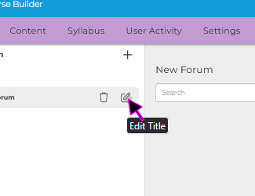|
| #10 ||
| Click on the editable field and enter in your desired name. ||
| #11 ||
| Once you are happy with the name, click the "Save" icon to apply these edits. |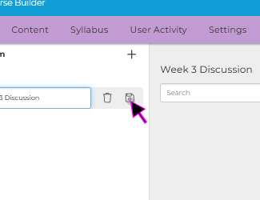|
| #12 ||
| Each Forum consists of individual "Threads" that may be created or commented on by Students or Teachers. To Create a new thread, click on the "+ Thread" icon. |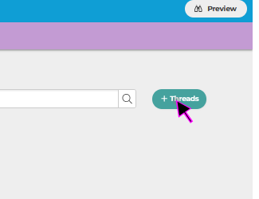|
| #13 ||
| Click under the "Subject" editable field to add a Title. ||
| #14 ||
| You can add "Body" text for the thread in the large "Rich Text Editor." ||
| #15 ||
| Once you are happy with your new thread, click the "Submit" button to add the Thread to the current Forum. ||
| #16 ||
| Next we will add a Text Module to direct Students to particpate in the new Forum. |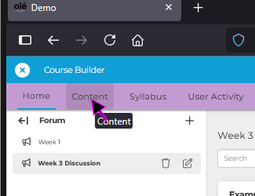|
| #17 ||
| Expand the "Section" where you would like to add your "Text Module" section. |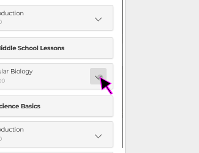|
| #18 ||
| Click on the "Add Module" button under this section. |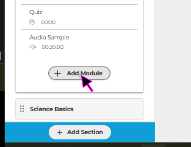|
| #19 ||
| Click on the "Text Module" icon. ||
| #20 ||
| Add a Module Title like "Week 3 Forum Discussion Assignment." ||
| #21 ||
| Add instructions for the students like "Please create one new thread and respond to two others in the Week 3 Forum." ||
| #22 ||
| When you are happy with your Instructive "Text Module" click the Save button. |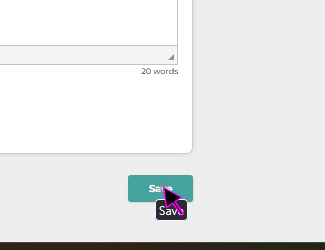|
| #23 ||
| If you would like to monitor student's progress later, you may return to the "Home" tab in course builder. |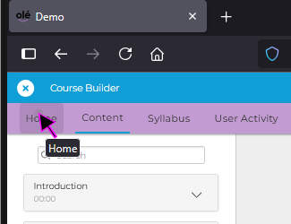|
| #24 ||
| Next return to the "Discussions" menu item. |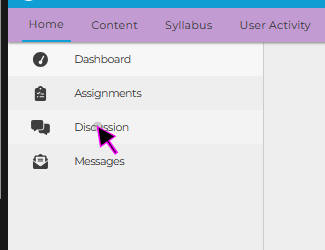|
| #25 ||
| You can now click back into the discussion for to monitor the resposne from students. |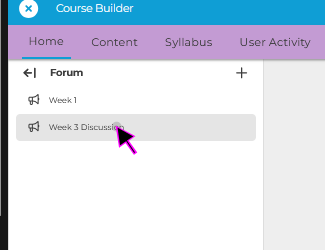|
| #26 ||
| You can create all of your Forums in advance if you would like "Week 3, Week 5, etc) ||
| #27 ||
| If you ever need to delete a Forum you can use the "Trash" icon. ||
| #28 ||
| You will receive a warning message, as this action cannot be undone. ||
| #29 ||
| This concludes this guide on "How to use Forums and Discussion Board Assignments in Course Builder." |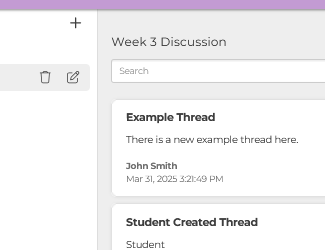|
