[Watch the Video](https://www.youtube.com/watch?v=###########)

  
Video Transcript

  Default Spoiler Text

| How to use Forums and Discussion Board Assignments in Course Builder ||
|-:|-|
| #1 ||
| Click on the "Courses" Left-Nav Item. ||
| #2 ||
| Navigate to the course where you want to review or add Discussions. ||
| #3 ||
| In Course Builder, under Home, click on the "Discussion" menu item. ||
| #4 ||
| You will see all existing "Forums" in the Left Panel. Click into an existing Forum to view it's contents. ||
| #5 ||
| Within a Forum there are multiple "Threads." You may reivew a Thread by clicking into it. |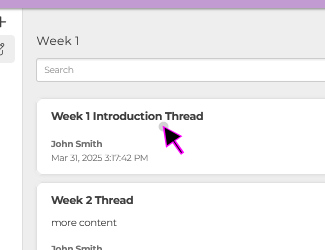|
| #6 ||
| Once inside the thread you can review all messages posted by Teachers or Students, and their responses will be time-stamped. ||
| #7 ||
| To Create a New "Forum" click on the Plus Icon next to Forum. |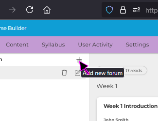|
| #8 ||
| By default, all new Forums are called "New Forum," but this can be renamed in the next steps. Click on this text to select the new Forum. |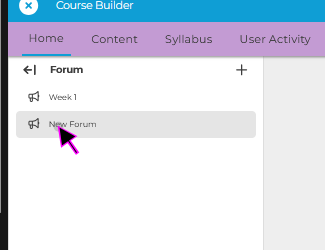|
| #9 ||
| Click on the "Pencil" icon next to the new Forum to allow it's name to be editable. ||
| #10 ||
| Click on the editable field and enter in your desired name. |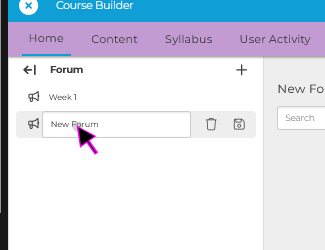|
| #11 ||
| Once you are happy with the name, click the "Save" icon to apply these edits. ||
| #12 ||
| Each Forum consists of individual "Threads" that may be created or commented on by Students or Teachers. To Create a new thread, click on the "+ Thread" icon. ||
| #13 ||
| Click under the "Subject" editable field to add a Title. |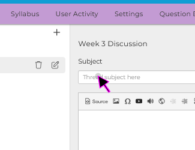|
| #14 ||
| You can add "Body" text for the thread in the large "Rich Text Editor." |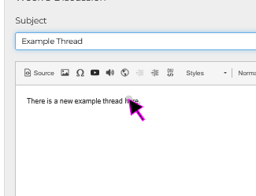|
| #15 ||
| Once you are happy with your new thread, click the "Submit" button to add the Thread to the current Forum. |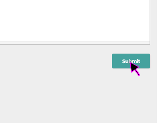|
| #16 ||
| Next we will add a Text Module to direct Students to particpate in the new Forum. ||
| #17 ||
| Expand the "Section" where you would like to add your "Text Module" section. ||
| #18 ||
| Click on the "Add Module" button under this section. ||
| #19 ||
| Click on the "Text Module" icon. |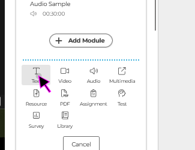|
| #20 ||
| Add a Module Title like "Week 3 Forum Discussion Assignment." |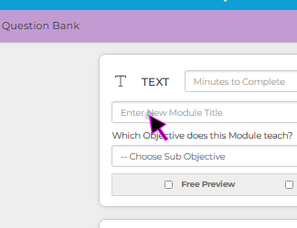|
| #21 ||
| Add instructions for the students like "Please create one new thread and respond to two others in the Week 3 Forum." ||
| #22 ||
| When you are happy with your Instructive "Text Module" click the Save button. ||
| #23 ||
| If you would like to monitor student's progress later, you may return to the "Home" tab in course builder. ||
| #24 ||
| Next return to the "Discussions" menu item. ||
| #25 ||
| You can now click back into the discussion for to monitor the resposne from students. ||
| #26 ||
| You can create all of your Forums in advance if you would like "Week 3, Week 5, etc) |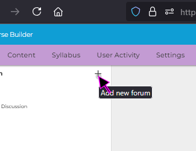|
| #27 ||
| If you ever need to delete a Forum you can use the "Trash" icon. |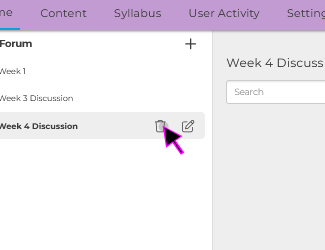|
| #28 ||
| You will receive a warning message, as this action cannot be undone. |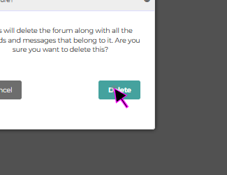|
| #29 ||
| This concludes this guide on "How to use Forums and Discussion Board Assignments in Course Builder." ||
