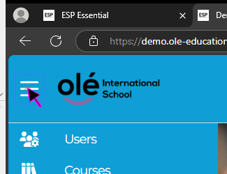
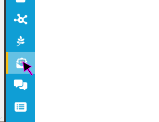
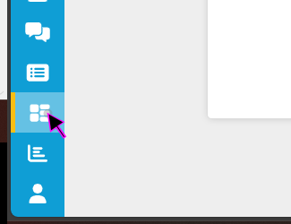

| Desktop Overview ||
|-|-|
| #1 ||
| User Managemetn is where you go to manage users. ||
| #2 ||
| In Courses you can manage courses. ||
| #3 ||
| In Programs you can view and edit Programs. ||
| #4 ||
| In Store Management you can manage the store. ||
| #5 ||
| In Organization Management you can edit setttings for the entire Organization. ||
| #6 ||
| In Branch you can edit branch settings. ||
| #7 ||
| In messages you can view your messages. ||
| #8 ||
| In Forum you can view the Forum. ||
| #9 ||
| In Forms you can edit forms. ||
| #10 ||
| In Logic Models you can create scheduled, running tasks. ||
| #11 ||
| In Reports you can edit reports. ||
| #12 ||
| In My Account you can edit your own account settings. ||
