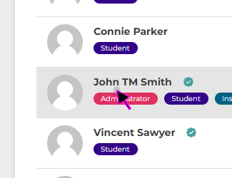
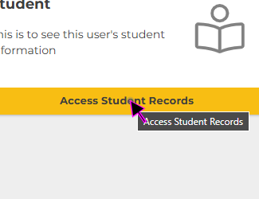
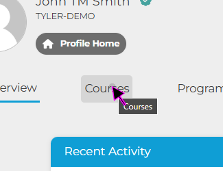
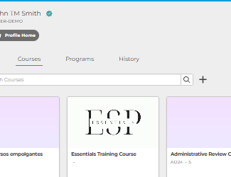
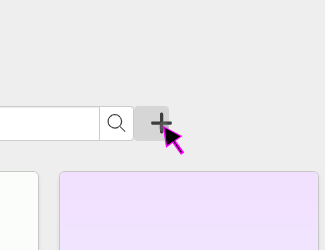
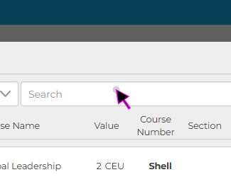
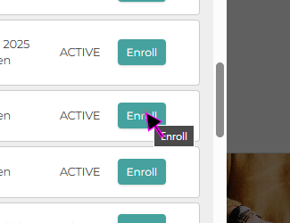

| How to Enroll Students in Classes ||
|-|-|
| #1 ||
|  Click on the 'Users' Left-Nav Icon. ||
| #2 ||
|  Click on the 'Student' user you would like to edit. ||
| #3 ||
|  Click on the 'Access Student Records' from the user's Profile Home. ||
| #4 ||
|  Click on the 'Courses' Tab within Student Records. ||
| #5 ||
| In msedge, Left Click on  group  ||
| #6 ||
| In msedge, Left Click on  button Enroll in course ||
| #7 ||
| In msedge, Left Click on  edit Search ||
| #8 ||
| In msedge, Left Click on  button Enroll ||
| Finish: ||
| You will Return to the student's 'Courses' tab; and you can verify the class you enrolled them in now appears in this view. This concludes the guide on "How to Enroll Students in Classes or Programs" ||
