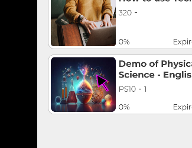

| Mobile Overview ||
|-|-|
| #1 ||
| The Left-Nave Menu Icons from Desktop are located under the left-hand 'Hamburger Button' ||
| #2 ||
| A Student will have 'Messages' and 'Forums' available here. ||
| #3 ||
| This is the Forums button. ||
| #4 ||
| Forums will have new updates from class-specific discussion forums as well as global announcements. ||
| #5 ||
| The 'Home' icon for a student will lead to the 'My Courses' overview screen. ||
| #6 ||
| This will default to the 'Active Courses' view, and a student can drill-down into a selected course to view content and complete course activities. ||
| #7 ||
| The navigation bars will turn yellow to indiciate you are inside of a course, to leave the course you can click on the 'x' button in the upper left hand corner. ||
| #8 ||
| The middle 'Profile Bubble' contains the 'My Profile' overview. ||
| #9 ||
| From here you can modify your Profile Information or other settings. ||
| #10 ||
| The 'Bell' icons contain notifications, ||
| #11 ||
| Navigating to this menu icon caused the App to Crash for me. ||
| #12 ||
| The Right Icon is for the AI Assistant Violet. ||
| #13 ||
| This button did not seem to work for me to clear the maintence notifications. ||
| #14 ||
| I got continual crashes periodically after I clicked the notification icon. ||
| #15 ||
| In scrcpy, Left Click on  pane Pixel 8 ||
| #16 ||
| In scrcpy, Left Click on  pane Pixel 8 ||
| #17 ||
| In scrcpy, Left Click on  pane Pixel 8 ||
| #18 ||
| In scrcpy, Left Click on  pane Pixel 8 ||
| #19 ||
| In scrcpy, Left Click on  pane Pixel 8 ||
| #20 ||
| In scrcpy, Left Click on  pane Pixel 8 ||
| #21 ||
| In scrcpy, Left Click on  pane Pixel 8 ||
| #22 ||
| In scrcpy, Left Click on  pane Pixel 8 ||
| #23 ||
| In scrcpy, Left Click on  pane Pixel 8 ||
| #24 ||
| In scrcpy, Left Click on  pane Pixel 8 ||
| #25 ||
| In scrcpy, Left Click on  pane Pixel 8 ||
| #26 ||
| In scrcpy, Left Click on  pane Pixel 8 ||
| #27 ||
| In scrcpy, Left Click on  pane Pixel 8 ||
| #28 ||
| In scrcpy, Left Click on  pane Pixel 8 ||
| #29 ||
| In scrcpy, Left Click on  pane Pixel 8 ||
| #30 ||
| In scrcpy, Left Click on  pane Pixel 8 ||
| #31 ||
| In scrcpy, Left Click on  pane Pixel 8 ||
| #32 ||
| In scrcpy, Left Click on  pane Pixel 8 ||
| #33 ||
| In scrcpy, Left Click on  pane Pixel 8 ||
