[Watch the Video](https://www.youtube.com/watch?v=kqP79bdcFq4)

  
Video Transcript

  At this point in time, as a registrar, you have had a student apply, you have approved their application, and now the question is: do you want the student to self-enroll in courses and programs, or do you want to place them in a course and program? This really depends on what you would like to do.

~

Many times, if it's an individual course, you might let the student enroll themselves, but if it is for a program, we suggest that you put them in the program.

~

Here's how you would do it: you have gone through the approval process, and you have someone who is approved. You're going to go back to that student and look at their student records. In their student records, you will see programs, and you can click on this to see all the different programs that are available.

~

You enroll them by hitting "enroll." This particular student is already enrolled in two different programs, so that's fine. You can also see what courses the student is enrolled in and self-enroll them from the administrative side by seeing what other courses are available and hitting "enroll."

~

Now, let's look at this from the student perspective. As a student, when you look at your student records, it shows a lot of information right off the bat. It gives you a general overview, which we will show how to set up at a later date.

~

It shows what programs you are in and where you are in that program. For example, in an older program, it shows that they have already taken certain courses and completed them. It also shows other courses that need to be taken. Students can perform a degree audit by saying they need to take one more course. They can register right there and go to the marketplace to see exactly what they need to register in and what to do next.

~

From the student record, they can see all the information about themselves. It would be recommended that you place them into the program. How to build a program will be another part, and maybe someone else can do it.

~

So let's review: you have created the application, students have applied, you have accepted them, and you have placed them into a program.

(Please be aware that this video may not include all the latest updates to the software, but the core functioning is largely unchanged. There also may be some slight difference due to organization-specific customizations. First recorded April 2024.)

| How to Enroll Students in Classes or Programs, and How to Allow Self-Enrollment ||
|-|-|
| #1 ||
|  Click on the User Left-Nav Menu Icon. ||
| #2 ||
| Navigate to a Student who you would like to enroll in Courses or Programs. |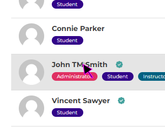|
| #3 ||
| In the Student's Profile Home page, click on the 'Access Student Records' Button. |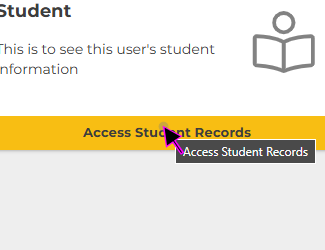|
| #4 ||
| To Enroll a student in a Program, click on the 'Program' tab on the Student Records view. |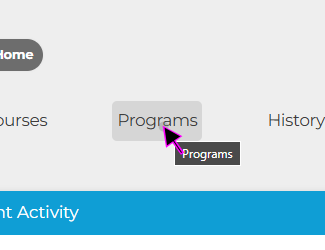|
| #5 ||
| Click on the blue "+Add" button in the Programs tab to open a list of available Programs. |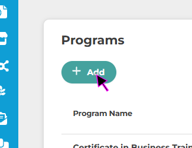|
| #6 ||
| In the "Add Program" pop-out, you can search for available programs using the textbox. |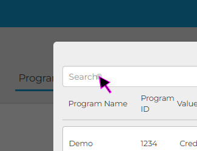|
| #7 ||
| Click on the "Enroll" button next to the desired Programs to enroll the selected Student in that Program. |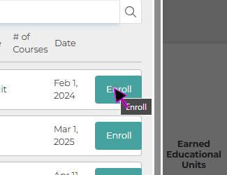|
| #8 ||
| If you would like to enroll the Student in individual Courses, use the 'Courses' tab on their Student Profile view. |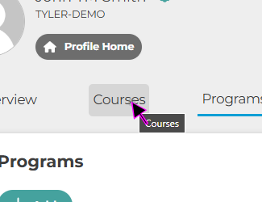|
| #9 ||
| Under the Student Record 'Courses' tab click on the 'Plus' icon to Enroll the Student in a specific course. |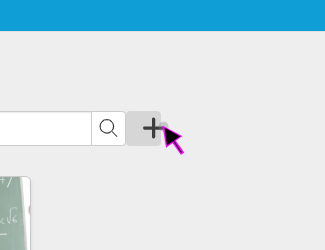|
| #10 ||
| The "Add Course" pop-out is similair to the "Add Program" pop-out covered in Step 6 and 7. Click on the "Enroll" button next to the desired Course to enroll the selected Student in that Course. |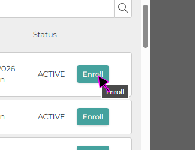|
| Self-Enrollment as a Student: ||
|  |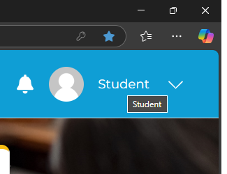|
| #11 ||
| Click on the 'My Account' Left-Nav Icon. |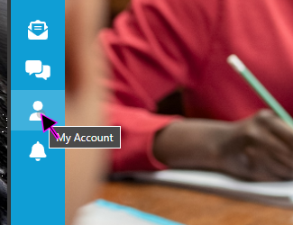|
| #12 ||
| Click on the 'Access Student Records' Button. |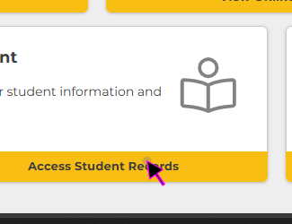|
| #13 ||
| Click on the Programs tab. |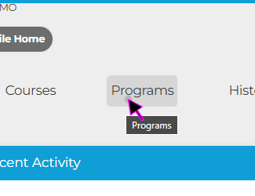|
| #14 ||
| Click on a Program where you would like to enroll in neccesary courses. |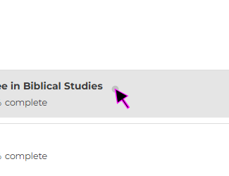|
| #15 ||
| Click on the "Enroll" button next to the course you would like to Enroll in. You will be directed to the Marketplace where you can purcahse the course, if neccesary. |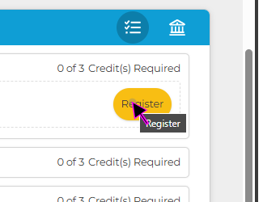|
| Conclusion: ||
|  This concludes the article on Enrolling Students in Courses. Remember you can always review a student's current Program progress from their 'Student Records' page as needed. |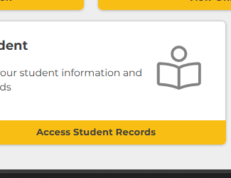|
