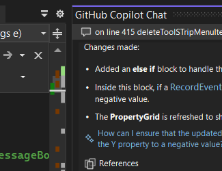
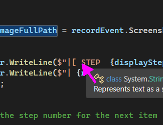
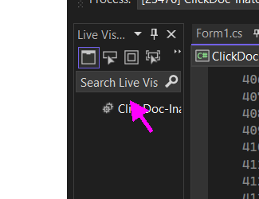
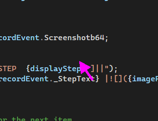

| how to click around visual studio ||
|-:|-|
|[ STEP  01 ]||
| In devenv, Left Click on  list view  ||
|[ STEP  02 ]||
| In devenv, Left Click on  custom  ||
|[ STEP  03 ]||
| In devenv, Left Click on  list view  ||
|[ STEP  04 ]||
| In devenv, Left Click on  custom  ||
|[ STEP  05 ]||
| In devenv, Left Click on  edit Text Editor ||
|[ STEP  06 ]||
| In devenv, Left Click on  custom  ||
